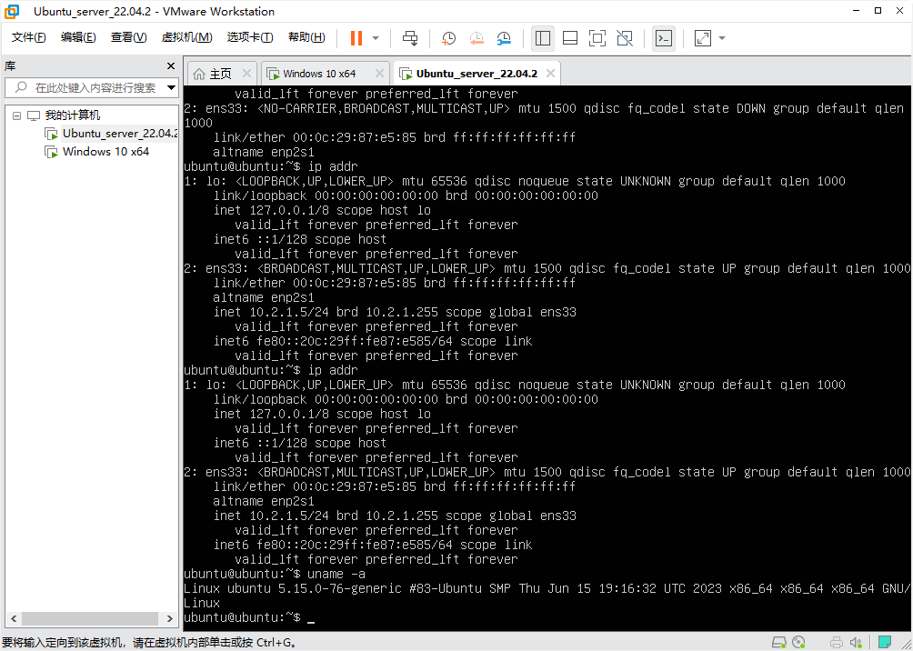

# 课程设计-园区网络

## 网络拓补


注：
- AR为AR3260
- 交换机为S5700
- AC为AC6605
- AP为AP9131
- 防火墙为USG6000V

## 题目要求

一.大庆油田1公司和2公司网络互联场景

   1. 网元数量大于10个，终端设备10-15个每公司（可酌情删减）
   2. 需要划分虚拟局域网
   3. 标注和规划好各个部门所在的网段
   4. 实现1、2公司的网络互通
   5. 网络层次划分清晰（汇聚、核心、接入）
   **必须使用的协议：ospf/vlan/is-is**

## 配置思路

公司1网络规划
- OSPF单区域 统一在area 0
- 划分Vlan 10 11 20 22 30 40 50 60 70 100
  - Vlan 10 20 30 40 50 60 70分到了每个部门，如下表
    |Vlan ID|部门|Wlan名称|
    |----|----|----|
    |10|研发部|wlan-dev-5G/2.4G|
    |20|人事部|wlan-hr-5G/2.4G|
    |30|党支部|wlan-party-5G/2.4G|
    |40|总裁办公室|wlan-ceo-5G/2.4G|
    |50|销售部|wlan-sales-5G/2.4G|
    |60|财务部|wlan-financial-5G/2.4G|
    |70|保卫处|wlan-guard-5G/2.4G|
  - Vlan 11 22 负责路由器与交换机互联
  - Vlan 100 负责CAPWAP隧道
- DHCP服务分配IP网段如下表
    |分配网段|部门|DNS|网关|
    |----|----|----|----|
    |10.1.10.0/24|研发部|10.1.99.1|10.1.10.254|
    |10.1.20.0/24|人事部|10.1.99.1|10.1.20.254|
    |10.1.30.0/24|党支部|10.1.99.1|10.1.30.254|
    |10.1.40.0/24|总裁办公室|10.1.99.1|10.1.40.254|
    |10.1.50.0/24|销售部|10.1.99.1|10.1.50.254|
    |10.1.60.0/24|财务部|10.1.99.1|10.1.60.254|
    |10.1.70.0/24|保卫处|10.1.99.1|10.1.70.254|
- DHCP服务器均使用了VRRP进行热备，虚拟IP均为网关地址
- 防火墙使用了HRP进行双机热备，并负责NAT，网段为60.15.135.0（黑龙江联通）
  - NAT地址池包括60.15.135.10 - 60.15.135.20
- 总裁办公室下增加了Windows10虚拟机的连接，负责Web浏览以及ssh连接
- DNS服务器使用了Server1，eNSP自带
- FTP服务器在Server2，没有用户名和密码，公司2中虚拟机也有
- 公司1的Web地址为company1.com

公司2网络规划
- OSPF单区域 统一在area 0
- 划分Vlan 210 211 222
  - 210用于公司2设备上网
  - 211 222用于交换机和路由器的互联
- DHCP服务分配IP网段统一为10.2.1.0/24
- 防火墙和路由器均做好了热备
- 公网IP网段为60.15.134.0（黑龙江联通）
  - NAT地址池包括60.15.134.10 - 60.15.134.20
- 公司2交换机2下面链接了Ubuntu Server的虚拟机，负责Web服务的提供，开启SSH和FTP（服务器中安装了NGINX，PHP和MySQL）
- 公司2的Web地址为company2.com

公司1和公司2互通配置
- 使用IS-IS协议
- 协议配置在公司2路由器2和公司1路由器1中

外网配置
- 使用IS-IS协议

## 配置命令

### 公司1园区路由器

```bash
system-view
sysname Company_1-P-R

isis 1
network-entity 49.0002.0000.0000.0001.00

interface GigabitEthernet 0/0/0
ip address 60.15.135.1 24
isis enable

interface GigabitEthernet 0/0/1
ip address 10.254.254.2 24
isis enable

interface GigabitEthernet 0/0/2
ip address 10.254.253.1 24
isis enable

```

### 公司1交换机

**无需配置**

### 公司1防火墙1

```bash
system-view
sysname Company_1-FW1

interface GigabitEthernet 1/0/0
ip address 10.1.253.1 24
interface GigabitEthernet 1/0/1
ip address 10.1.254.1 24
interface GigabitEthernet 1/0/2
ip address 10.1.252.1 24

firewall zone trust
add interface GigabitEthernet 1/0/2
firewall zone untrust
add interface GigabitEthernet 1/0/0
firewall zone dmz
add interface GigabitEthernet 1/0/1

interface GigabitEthernet 1/0/2
vrrp vrid 1 virtual-ip 10.1.252.254 24 active
interface GigabitEthernet 1/0/0
vrrp vrid 2 virtual-ip 60.15.135.2 24 active
quit

hrp interface GigabitEthernet1/0/1 remote 10.1.254.2
hrp enable

security-policy
rule name d-l
source-zone dmz local
destination-zone dmz local
action permit
rule name t-u
source-zone trust
destination-zone untrust
action permit
quit

nat address-group group1
mode pat
section 60.15.135.10 60.15.135.20
nat-policy
rule name nat1
source-zone trust
destination-zone untrust
source-address 10.1.0.0  16
action source-nat address-group group1

ospf 1
area 0
network 60.15.135.0 0.0.0.255
network 10.1.252.0 0.0.0.255
network 10.1.253.0 0.0.0.255
network 10.1.254.0 0.0.0.255

ip route-static 0.0.0.0 0 60.15.135.1

quit
quit
quit
save
```

### 公司1防火墙2

```bash
system-view
sysname Company_1-FW2

interface GigabitEthernet 1/0/0
ip address 10.1.253.2 24
interface GigabitEthernet 1/0/1
ip address 10.1.254.2 24
interface GigabitEthernet 1/0/2
ip address 10.1.252.2 24

firewall zone trust
add interface GigabitEthernet 1/0/2
firewall zone untrust
add interface GigabitEthernet 1/0/0
firewall zone dmz
add interface GigabitEthernet 1/0/1

interface GigabitEthernet 1/0/2
vrrp vrid 1 virtual-ip 10.1.252.254 24 standby
interface GigabitEthernet 1/0/0
vrrp vrid 2 virtual-ip 60.15.135.2 24 standby
quit

hrp interface GigabitEthernet1/0/1 remote 10.1.254.1
hrp enable

ip route-static 0.0.0.0 0 60.15.135.1

quit
save
```

### 公司1路由器1

```bash
system-view
sysname Company_1-R1

dhcp enable

ospf 1
import-route isis 1
area 0
network 10.1.99.0 0.0.0.255
network 10.1.250.0 0.0.0.255
network 10.1.251.0 0.0.0.255
network 10.1.252.0 0.0.0.255
isis 1
network-entity 49.0001.0000.0000.0001.00
import-route ospf 1

ip pool vlan99
network 10.1.99.0 mask 255.255.255.0
gateway-list 10.1.99.254
excluded-ip-address 10.1.99.1 10.1.99.10
dns-list 10.1.99.1

interface GigabitEthernet 0/0/0
ip address 10.1.252.3 24
interface GigabitEthernet 0/0/1
ip address 10.1.250.1 24
interface GigabitEthernet 0/0/2
ip address 10.1.251.1 24

interface GigabitEthernet 4/0/0
ip address 10.12.0.1 24
isis enable

interface GigabitEthernet 4/0/1
ip address 10.1.99.3 24
vrrp vrid 9 virtual-ip 10.1.99.254
vrrp vrid 9 priority 200
dhcp select global

```


### 公司1路由器2

```bash
system-view
sysname Company_1-R2

dhcp enable

ospf 1
area 0
network 10.1.99.0 0.0.0.255
network 10.1.249.0 0.0.0.255
network 10.1.251.0 0.0.0.255
network 10.1.252.0 0.0.0.255

ip pool vlan99
network 10.1.99.0 mask 255.255.255.0
gateway-list 10.1.99.254
excluded-ip-address 10.1.99.1 10.1.99.10
dns-list 10.1.99.1

interface GigabitEthernet 0/0/0
ip address 10.1.252.4 24
interface GigabitEthernet 0/0/1
ip address 10.1.249.1 24
interface GigabitEthernet 0/0/2
ip address 10.1.251.2 24

interface GigabitEthernet 4/0/1
ip address 10.1.99.4 24
vrrp vrid 9 virtual-ip 10.1.99.254
dhcp select global
quit


quit
save
y
```

### 公司1交换机1

```bash
system-view
sysname Company_1-SW1

vlan batch 10 11 20 22 30
vlan batch 40 50 60 70 100
dhcp enable

ip pool vlan10
network 10.1.10.0 mask 255.255.255.0
gateway-list 10.1.10.254
excluded-ip-address 10.1.10.1 10.1.10.10
dns-list 10.1.99.1

ip pool vlan20
network 10.1.20.0 mask 255.255.255.0
gateway-list 10.1.20.254
excluded-ip-address 10.1.20.1 10.1.20.10
dns-list 10.1.99.1

ip pool vlan30
network 10.1.30.0 mask 255.255.255.0
gateway-list 10.1.30.254
excluded-ip-address 10.1.30.1 10.1.30.10
dns-list 10.1.99.1

ip pool vlan40
network 10.1.40.0 mask 255.255.255.0
gateway-list 10.1.40.254
excluded-ip-address 10.1.40.1 10.1.40.10
dns-list 10.1.99.1

ip pool vlan50
network 10.1.50.0 mask 255.255.255.0
gateway-list 10.1.50.254
excluded-ip-address 10.1.50.1 10.1.50.10
dns-list 10.1.99.1

ip pool vlan60
network 10.1.60.0 mask 255.255.255.0
gateway-list 10.1.60.254
excluded-ip-address 10.1.60.1 10.1.60.10
dns-list 10.1.99.1

ip pool vlan70
network 10.1.70.0 mask 255.255.255.0
gateway-list 10.1.70.254
excluded-ip-address 10.1.70.1 10.1.70.10
dns-list 10.1.99.1

ospf 1
area 0
network 10.1.10.0 0.0.0.255
network 10.1.20.0 0.0.0.255
network 10.1.30.0 0.0.0.255
network 10.1.40.0 0.0.0.255
network 10.1.50.0 0.0.0.255
network 10.1.60.0 0.0.0.255
network 10.1.70.0 0.0.0.255
network 10.1.250.0 0.0.0.255

interface Vlanif 10
ip address 10.1.10.1 24
vrrp vrid 1 virtual-ip 10.1.10.254
vrrp vrid 1 priority 200
dhcp select global

interface Vlanif 11
ip address 10.1.250.2 24

interface Vlanif 20
ip address 10.1.20.1 24
vrrp vrid 2 virtual-ip 10.1.20.254
vrrp vrid 2 priority 200
dhcp select global

interface Vlanif 30
ip address 10.1.30.1 24
vrrp vrid 3 virtual-ip 10.1.30.254
vrrp vrid 3 priority 200
dhcp select global

interface Vlanif 40
ip address 10.1.40.1 24
vrrp vrid 4 virtual-ip 10.1.40.254
vrrp vrid 4 priority 200
dhcp select global

interface Vlanif 50
ip address 10.1.50.1 24
vrrp vrid 5 virtual-ip 10.1.50.254
vrrp vrid 5 priority 200
dhcp select global

interface Vlanif 60
ip address 10.1.60.1 24
vrrp vrid 6 virtual-ip 10.1.60.254
vrrp vrid 6 priority 200
dhcp select global

interface Vlanif 70
ip address 10.1.70.1 24
vrrp vrid 7 virtual-ip 10.1.70.254
vrrp vrid 7 priority 200
dhcp select global

interface GigabitEthernet 0/0/1
port link-type access
port default vlan 11
interface GigabitEthernet 0/0/3
port link-type trunk
port trunk allow-pass vlan 100
interface GigabitEthernet 0/0/4
port link-type trunk
port trunk allow-pass vlan 10 100
interface GigabitEthernet 0/0/5
port link-type trunk
port trunk allow-pass vlan 20 100
interface GigabitEthernet 0/0/6
port link-type trunk
port trunk allow-pass vlan 30 100
interface GigabitEthernet 0/0/7
port link-type trunk
port trunk allow-pass vlan 40 100
interface GigabitEthernet 0/0/8
port link-type trunk
port trunk allow-pass vlan 50 100
interface GigabitEthernet 0/0/9
port link-type trunk
port trunk allow-pass vlan 60 100
interface GigabitEthernet 0/0/10
port link-type trunk
port trunk allow-pass vlan 10 11 20 22 30
port trunk allow-pass vlan 40 50 60 70 100


quit
save
y
```

### 公司1交换机2

```bash
system-view
sysname Company_1-SW2

vlan batch 10 11 20 22 30
vlan batch 40 50 60 70 100
dhcp enable

ip pool vlan10
network 10.1.10.0 mask 255.255.255.0
gateway-list 10.1.10.254
excluded-ip-address 10.1.10.1 10.1.10.10
dns-list 10.1.99.1

ip pool vlan20
network 10.1.20.0 mask 255.255.255.0
gateway-list 10.1.20.254
excluded-ip-address 10.1.20.1 10.1.20.10
dns-list 10.1.99.1

ip pool vlan30
network 10.1.30.0 mask 255.255.255.0
gateway-list 10.1.30.254
excluded-ip-address 10.1.30.1 10.1.30.10
dns-list 10.1.99.1

ip pool vlan40
network 10.1.40.0 mask 255.255.255.0
gateway-list 10.1.40.254
excluded-ip-address 10.1.40.1 10.1.40.10
dns-list 10.1.99.1

ip pool vlan50
network 10.1.50.0 mask 255.255.255.0
gateway-list 10.1.50.254
excluded-ip-address 10.1.50.1 10.1.50.10
dns-list 10.1.99.1

ip pool vlan60
network 10.1.60.0 mask 255.255.255.0
gateway-list 10.1.60.254
excluded-ip-address 10.1.60.1 10.1.60.10
dns-list 10.1.99.1

ip pool vlan70
network 10.1.70.0 mask 255.255.255.0
gateway-list 10.1.70.254
excluded-ip-address 10.1.70.1 10.1.70.10
dns-list 10.1.99.1

ospf 1
area 0
network 10.1.10.0 0.0.0.255
network 10.1.20.0 0.0.0.255
network 10.1.30.0 0.0.0.255
network 10.1.40.0 0.0.0.255
network 10.1.50.0 0.0.0.255
network 10.1.60.0 0.0.0.255
network 10.1.70.0 0.0.0.255
network 10.1.249.0 0.0.0.255

interface Vlanif 10
ip address 10.1.10.2 24
vrrp vrid 1 virtual-ip 10.1.10.254
dhcp select global

interface Vlanif 20
ip address 10.1.20.2 24
vrrp vrid 2 virtual-ip 10.1.20.254
dhcp select global

interface Vlanif 22
ip address 10.1.249.2 24

interface Vlanif 30
ip address 10.1.30.2 24
vrrp vrid 3 virtual-ip 10.1.30.254
dhcp select global

interface Vlanif 40
ip address 10.1.40.2 24
vrrp vrid 4 virtual-ip 10.1.40.254
dhcp select global

interface Vlanif 50
ip address 10.1.50.2 24
vrrp vrid 5 virtual-ip 10.1.50.254
dhcp select global

interface Vlanif 60
ip address 10.1.60.2 24
vrrp vrid 6 virtual-ip 10.1.60.254
dhcp select global
interface Vlanif 70
ip address 10.1.70.2 24
vrrp vrid 7 virtual-ip 10.1.70.254
dhcp select global

interface GigabitEthernet 0/0/1
port link-type access
port default vlan 22
interface GigabitEthernet 0/0/3
port link-type trunk
port trunk pvid vlan 100
port trunk allow-pass vlan 70 100
interface GigabitEthernet 0/0/4
port link-type trunk
port trunk allow-pass vlan 10 100
interface GigabitEthernet 0/0/5
port link-type trunk
port trunk allow-pass vlan 20 100
interface GigabitEthernet 0/0/6
port link-type trunk
port trunk allow-pass vlan 30 100
interface GigabitEthernet 0/0/7
port link-type trunk
port trunk allow-pass vlan 40 100
interface GigabitEthernet 0/0/8
port link-type trunk
port trunk allow-pass vlan 50 100
interface GigabitEthernet 0/0/9
port link-type trunk
port trunk allow-pass vlan 60 100
interface GigabitEthernet 0/0/10
port link-type trunk
port trunk allow-pass vlan 10 11 20 22 30
port trunk allow-pass vlan 40 50 60 70 100

quit
save
y
```

### 公司1交换机2

**无需配置**

### 研发部-SW

```bash
system-view
sysname Development-SW

vlan batch 10 100

interface GigabitEthernet 0/0/1
port link-type trunk
port trunk allow-pass vlan 10 100
interface GigabitEthernet 0/0/2
port link-type trunk
port trunk allow-pass vlan 10 100
interface GigabitEthernet 0/0/3
port link-type trunk
port trunk pvid vlan 100
port trunk allow-pass vlan 10 100
interface GigabitEthernet 0/0/4
port link-type access
port default vlan 10

```

### 人事部-SW

```bash
system-view
sysname HumanResource-SW

vlan batch 20 100

interface GigabitEthernet 0/0/1
port link-type trunk
port trunk allow-pass vlan 20 100
interface GigabitEthernet 0/0/2
port link-type trunk
port trunk allow-pass vlan 20 100
interface GigabitEthernet 0/0/3
port link-type trunk
port trunk pvid vlan 100
port trunk allow-pass vlan 20 100
interface GigabitEthernet 0/0/4
port link-type access
port default vlan 20


```

### 党支部-SW

```bash
system-view
sysname Party_branch-SW

vlan batch 30 100

interface GigabitEthernet 0/0/1
port link-type trunk
port trunk allow-pass vlan 30 100
interface GigabitEthernet 0/0/2
port link-type trunk
port trunk allow-pass vlan 30 100
interface GigabitEthernet 0/0/3
port link-type trunk
port trunk pvid vlan 100
port trunk allow-pass vlan 30 100
interface GigabitEthernet 0/0/4
port link-type access
port default vlan 30

```

### 总裁办公室-SW

```bash
system-view
sysname CEO-SW

vlan batch 40 100

interface GigabitEthernet 0/0/1
port link-type trunk
port trunk allow-pass vlan 40 100
interface GigabitEthernet 0/0/2
port link-type trunk
port trunk allow-pass vlan 40 100
interface GigabitEthernet 0/0/3
port link-type trunk
port trunk pvid vlan 100
port trunk allow-pass vlan 40 100
interface GigabitEthernet 0/0/4
port link-type access
port default vlan 40
interface GigabitEthernet 0/0/5
port link-type access
port default vlan 40

```

### 销售部-SW

```bash
system-view
sysname Sales-SW

vlan batch 50 100

interface GigabitEthernet 0/0/1
port link-type trunk
port trunk allow-pass vlan 50 100
interface GigabitEthernet 0/0/2
port link-type trunk
port trunk allow-pass vlan 50 100
interface GigabitEthernet 0/0/3
port link-type trunk
port trunk pvid vlan 100
port trunk allow-pass vlan 50 100
interface GigabitEthernet 0/0/4
port link-type access
port default vlan 50

```

### 财务部-SW

```bash
system-view
sysname Financial-SW

vlan batch 60 100

interface GigabitEthernet 0/0/1
port link-type trunk
port trunk allow-pass vlan 60 100
interface GigabitEthernet 0/0/2
port link-type trunk
port trunk allow-pass vlan 60 100
interface GigabitEthernet 0/0/3
port link-type trunk
port trunk pvid vlan 100
port trunk allow-pass vlan 60 100
interface GigabitEthernet 0/0/4
port link-type access
port default vlan 60

```

### 公司1-AC

```bash
system-view
sysname Company_1-AC

dhcp enable

vlan 100
vlan pool Company_1
vlan 10 20 30 40 50 60 70
quit

interface Vlanif 100
ip address 10.1.100.254 24
dhcp select interface
dhcp server excluded-ip-address 10.1.100.1 10.1.100.10
interface GigabitEthernet 0/0/1
port link-type trunk
port trunk allow-pass vlan 100
quit

capwap source interface Vlanif 100

wlan
ap auth-mode mac-auth
security-profile name dev
security wpa2 psk pass-phrase dev@123456 aes

security-profile name hr
security wpa2 psk pass-phrase hr@123456 aes

security-profile name party
security wpa2 psk pass-phrase party@123456 aes

security-profile name ceo
security wpa2 psk pass-phrase ceo@123456 aes

security-profile name sales
security wpa2 psk pass-phrase sales@123456 aes

security-profile name financial
security wpa2 psk pass-phrase financial@123456 aes

security-profile name guard
security wpa2 psk pass-phrase guard@123456 aes

ssid-profile name dev-2.4G
ssid wlan-dev-2.4G
ssid-profile name dev-5G
ssid wlan-dev-5G

ssid-profile name hr-2.4G
ssid wlan-hr-2.4G
ssid-profile name hr-5G
ssid wlan-hr-5G

ssid-profile name party-2.4G
ssid wlan-party-2.4G
ssid-profile name party-5G
ssid wlan-party-5G

ssid-profile name ceo-2.4G
ssid wlan-ceo-2.4G
ssid-profile name ceo-5G
ssid wlan-ceo-5G

ssid-profile name sales-2.4G
ssid wlan-sales-2.4G
ssid-profile name sales-5G
ssid wlan-sales-5G

ssid-profile name financial-2.4G
ssid wlan-financial-2.4G
ssid-profile name financial-5G
ssid wlan-financial-5G

ssid-profile name guard-2.4G
ssid wlan-guard-2.4G
ssid-profile name guard-5G
ssid wlan-guard-5G

vap-profile name dev-2.4G
service-vlan vlan-pool Company_1
ssid-profile dev-2.4G
security-profile dev
service-vlan vlan-id 10
forward-mode direct-forward
vap-profile name dev-5G
service-vlan vlan-pool Company_1
ssid-profile dev-5G
security-profile dev
service-vlan vlan-id 10
forward-mode direct-forward

vap-profile name hr-2.4G
service-vlan vlan-pool Company_1
ssid-profile hr-2.4G
security-profile hr
service-vlan vlan-id 20
forward-mode direct-forward
vap-profile name hr-5G
service-vlan vlan-pool Company_1
ssid-profile hr-5G
security-profile hr
service-vlan vlan-id 20
forward-mode direct-forward

vap-profile name party-2.4G
service-vlan vlan-pool Company_1
ssid-profile party-2.4G
security-profile party
service-vlan vlan-id 30
forward-mode direct-forward
vap-profile name party-5G
service-vlan vlan-pool Company_1
ssid-profile party-5G
security-profile party
service-vlan vlan-id 30
forward-mode direct-forward

vap-profile name ceo-2.4G
service-vlan vlan-pool Company_1
ssid-profile ceo-2.4G
security-profile ceo
service-vlan vlan-id 40
forward-mode direct-forward
vap-profile name ceo-5G
service-vlan vlan-pool Company_1
ssid-profile ceo-5G
security-profile ceo
service-vlan vlan-id 40
forward-mode direct-forward

vap-profile name sales-2.4G
service-vlan vlan-pool Company_1
ssid-profile sales-2.4G
security-profile sales
service-vlan vlan-id 50
forward-mode direct-forward
vap-profile name sales-5G
service-vlan vlan-pool Company_1
ssid-profile sales-5G
security-profile sales
service-vlan vlan-id 50
forward-mode direct-forward

vap-profile name financial-2.4G
service-vlan vlan-pool Company_1
ssid-profile financial-2.4G
security-profile financial
service-vlan vlan-id 60
forward-mode direct-forward
vap-profile name financial-5G
service-vlan vlan-pool Company_1
ssid-profile financial-5G
security-profile financial
service-vlan vlan-id 60
forward-mode direct-forward

vap-profile name guard-2.4G
service-vlan vlan-pool Company_1
ssid-profile guard-2.4G
security-profile guard
service-vlan vlan-id 70
forward-mode direct-forward
vap-profile name guard-5G
service-vlan vlan-pool Company_1
ssid-profile guard-5G
security-profile guard
service-vlan vlan-id 70
forward-mode direct-forward

ap-group name dev
vap-profile dev-2.4G wlan 1 radio 0
vap-profile dev-5G wlan 1 radio 1

ap-group name hr
vap-profile hr-2.4G wlan 1 radio 0
vap-profile hr-5G wlan 1 radio 1

ap-group name party
vap-profile party-2.4G wlan 1 radio 0
vap-profile party-5G wlan 1 radio 1

ap-group name ceo
vap-profile ceo-2.4G wlan 1 radio 0
vap-profile ceo-5G wlan 1 radio 1

ap-group name sales
vap-profile sales-2.4G wlan 1 radio 0
vap-profile sales-5G wlan 1 radio 1

ap-group name financial
vap-profile financial-2.4G wlan 1 radio 0
vap-profile financial-5G wlan 1 radio 1

ap-group name guard
vap-profile guard-2.4G wlan 1 radio 0
vap-profile guard-5G wlan 1 radio 1

ap-id 1 ap-mac 00e0-fcf0-0d10
ap-name dev-AP
ap-group dev
y

ap-id 2 ap-mac 00e0-fc8a-62b0
ap-name hr-AP
ap-group hr
y

ap-id 3 ap-mac 00e0-fc0c-0aa0
ap-name party-AP
ap-group party
y

ap-id 4 ap-mac 00e0-fcfe-0c10
ap-name ceo-AP
ap-group ceo
y

ap-id 5 ap-mac 00e0-fc87-4f70
ap-name sales-AP
ap-group sales
y

ap-id 6 ap-mac 00e0-fc6a-7e10
ap-name financial-AP
ap-group financial
y

ap-id 7 ap-mac 00e0-fc34-7eb0
ap-name guard-AP
ap-group guard
y


```

### 公司2防火墙1

```bash
system-view
sysname Company_2-FW1

interface GigabitEthernet 1/0/0
ip address 10.2.253.1 24
interface GigabitEthernet 1/0/1
ip address 10.2.254.1 24
interface GigabitEthernet 1/0/2
ip address 10.2.252.1 24

firewall zone trust
add interface GigabitEthernet 1/0/2
firewall zone untrust
add interface GigabitEthernet 1/0/0
firewall zone dmz
add interface GigabitEthernet 1/0/1

interface GigabitEthernet 1/0/2
vrrp vrid 1 virtual-ip 10.2.252.254 24 active
interface GigabitEthernet 1/0/0
vrrp vrid 2 virtual-ip 60.15.134.2 24 active
quit

hrp interface GigabitEthernet1/0/1 remote 10.2.254.2
hrp enable

security-policy
rule name d-l
source-zone dmz local
destination-zone dmz local
action permit
rule name t-u
source-zone trust
destination-zone untrust
action permit
quit

nat address-group group1
mode pat
section 60.15.134.10 60.15.134.20
nat-policy
rule name nat1
source-zone trust
destination-zone untrust
source-address 10.2.0.0  16
action source-nat address-group group1

ospf 1
area 0
network 60.15.134.0 0.0.0.255
network 10.2.252.0 0.0.0.255
network 10.2.253.0 0.0.0.255
network 10.2.254.0 0.0.0.255

ip route-static 0.0.0.0 0 60.15.134.1

quit
quit
quit
save
```

### 公司2防火墙2

```bash
system-view
sysname Company_2-FW2

interface GigabitEthernet 1/0/0
ip address 10.2.253.2 24
interface GigabitEthernet 1/0/1
ip address 10.2.254.2 24
interface GigabitEthernet 1/0/2
ip address 10.2.252.2 24

firewall zone trust
add interface GigabitEthernet 1/0/2
firewall zone untrust
add interface GigabitEthernet 1/0/0
firewall zone dmz
add interface GigabitEthernet 1/0/1

interface GigabitEthernet 1/0/2
vrrp vrid 1 virtual-ip 10.2.252.254 24 standby
interface GigabitEthernet 1/0/0
vrrp vrid 2 virtual-ip 60.15.134.2 24 standby
quit

hrp interface GigabitEthernet1/0/1 remote 10.2.254.1
hrp enable
ip route-static 0.0.0.0 0 60.15.134.1

quit
save
```

### 公司2路由器1

```bash
system-view
sysname Company_2-R1

dhcp enable

ospf 1
area 0
network 10.2.1.0 0.0.0.255
network 10.2.2.0 0.0.0.255
network 10.2.251.0 0.0.0.255
network 10.2.252.0 0.0.0.255
network 10.12.0.0 0.0.0.255

interface GigabitEthernet 0/0/0
ip address 10.2.252.3 24
interface GigabitEthernet 0/0/1
ip address 10.2.2.1 24
interface GigabitEthernet 0/0/2
ip address 10.2.251.1 24

```

### 公司2路由器2

```bash
system-view
sysname Company_2-R2

ospf 1
import-route isis 1
area 0
network 10.2.3.0 0.0.0.255
network 10.2.251.0 0.0.0.255
network 10.2.252.0 0.0.0.255
isis 1
network-entity 49.0001.0000.0000.0002.00
import-route ospf 1

interface GigabitEthernet 0/0/0
ip address 10.2.252.4 24
interface GigabitEthernet 0/0/1
ip address 10.2.3.1 24
interface GigabitEthernet 0/0/2
ip address 10.2.251.2 24
interface GigabitEthernet 4/0/0
ip address 10.12.0.2 24
isis enable
```

### 公司2园区路由器

```bash
system-view
sysname Company_2-P-R

isis 1
network-entity 49.0002.0000.0000.0002.00


interface GigabitEthernet 0/0/0
ip address 60.15.134.1 24
isis enable

interface GigabitEthernet 0/0/1
ip address 10.254.254.1 24
isis enable

```

### 公司2交换机

**无需配置**

### 公司2交换机1

```bash
system-view
sysname Company_2-SW1

vlan batch 210 211 222

dhcp enable

ospf 1
area 0
network 10.2.1.0 0.0.0.255
network 10.2.2.0 0.0.0.255

ip pool Company_2
network 10.2.1.0 mask 255.255.255.0
gateway-list 10.2.1.254
excluded-ip-address 10.2.1.1 10.2.1.10

interface Vlanif 210
ip address 10.2.1.1 24
vrrp vrid 12 virtual-ip 10.2.1.254
vrrp vrid 12 priority 200
dhcp select global

interface Vlanif 211
ip address 10.2.2.2 24

interface GigabitEthernet 0/0/1
port link-type access
port default vlan 211

interface GigabitEthernet 0/0/3
port link-type trunk 
port trunk allow-pass vlan 210 211 222

interface GigabitEthernet 0/0/4
port link-type access
port default vlan 210

```

### 公司2交换机2

```bash
system-view
sysname Company_2-SW2

vlan batch 210 211 222

dhcp enable

ospf 1
area 0
network 10.2.1.0 0.0.0.255
network 10.2.3.0 0.0.0.255

ip pool Company_2
network 10.2.1.0 mask 255.255.255.0
gateway-list 10.2.1.254
excluded-ip-address 10.2.1.1 10.2.1.10

interface Vlanif 210
ip address 10.2.1.2 24
vrrp vrid 12 virtual-ip 10.2.1.254
dhcp select global

interface Vlanif 222
ip address 10.2.3.2 24

interface GigabitEthernet 0/0/1
port link-type access
port default vlan 222

interface GigabitEthernet 0/0/2
port link-type access
port default vlan 210

interface GigabitEthernet 0/0/3
port link-type trunk 
port trunk allow-pass vlan 210 211 222

interface GigabitEthernet 0/0/4
port link-type access
port default vlan 210
```


## 完成效果

### 公司1和公司2可以互通


### 公司1网站（使用Z-Blog）


### 公司2网站（使用WordPress）


### FTP服务


### DNS服务


### 服务器



### SSH


### NAT

